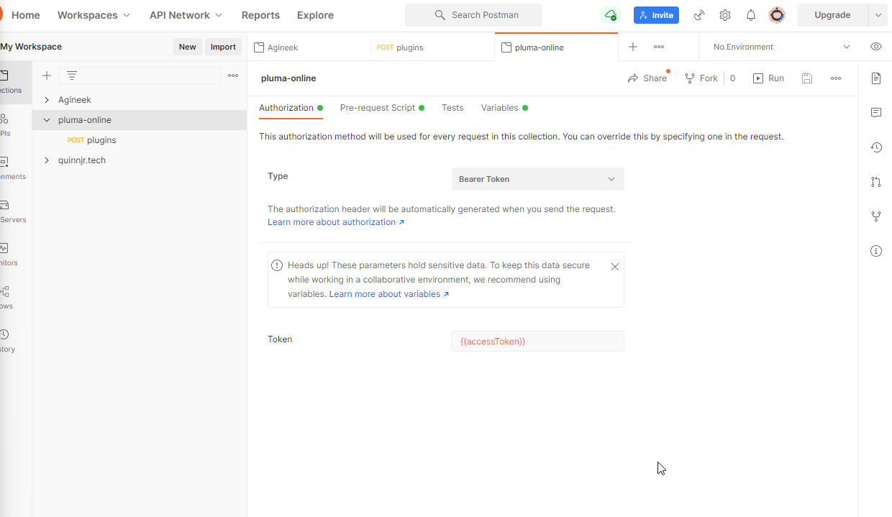

# Postman Configuration

To configure a [Postman](https://www.postman.com/) client to run test queries correctly for authenticated access to the GraphQL server, use the following as a *Pre-request Script* for the entire collection:

```js
const tokenUrl = 'http://localhost:4200/api/auth/login';

const getTokenRequest = {
    method: 'POST',
    url: tokenUrl,
    body: {
        mode: 'urlencoded',
        urlencoded: [
            {
                key: 'email',
                value: 'test@localhost'
            },
            {
                key: 'password',
                value: 'password'
            }
        ]
    }
};

pm.sendRequest(getTokenRequest, (err, res) => {
    if (err) {
        console.error(err);
    }

    const jsonResponse = res.json();
    console.log(jsonResponse);
    const accessToken = jsonResponse.accessToken;

    pm.collectionVariables.set('accessToken', accessToken);
});
```

*NOTE*: This script will only work if the database for the project is seeded from the provided `prisma db seed` script.

After creating the pre-request script, change to the 'Authorization' tab, change the 'Type' to 'Bearer Token' and add 'Token' as '{{accessToken}}.


